# Browser Go 
##### 0.9
A two-player [in-browser Go application](https://sorrelbri.github.io/browser-go/) developed by Sorrel June. 

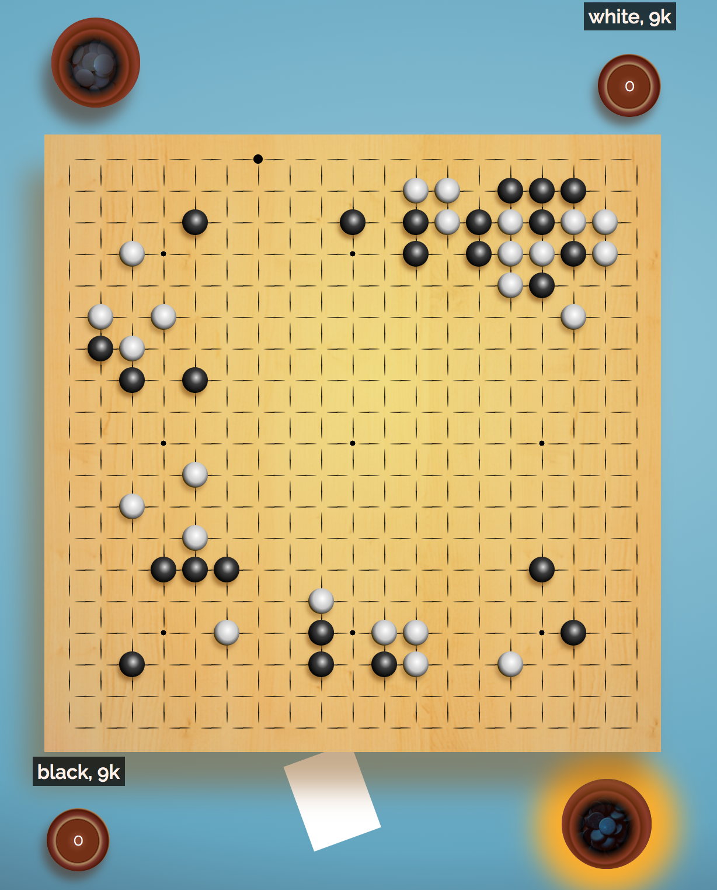
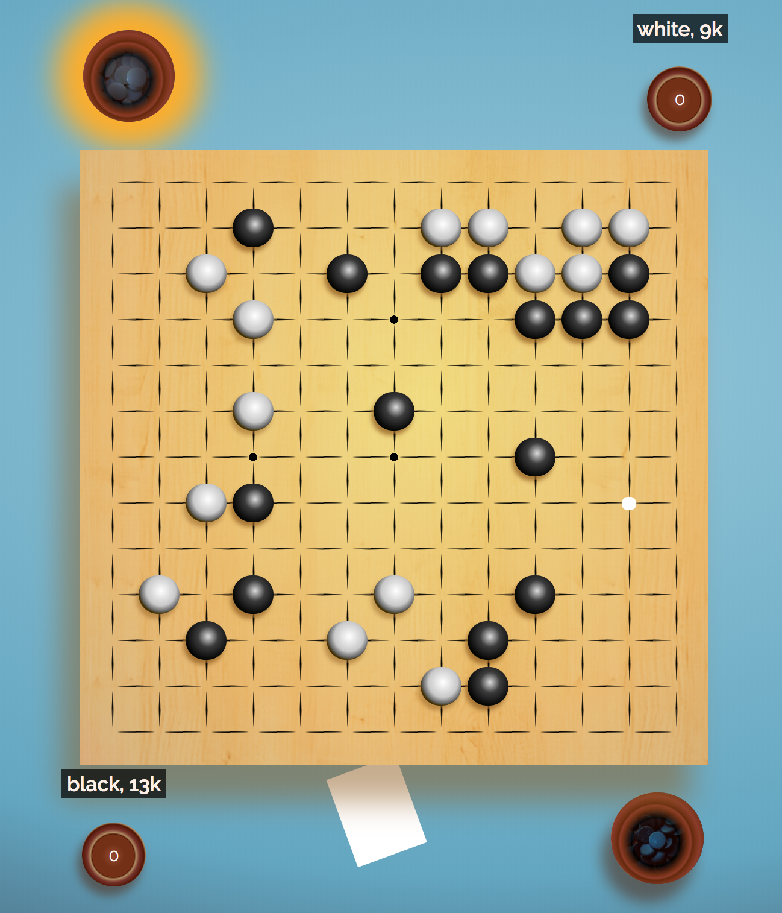

---
## The Game of Go
---
[Skip to Browser Go details](#how-browser-go-was-built)

Go is the oldest continuously played game on Earth. The Go ruleset can be understood in an afternoon while offering a depth and complexity that inspires for a lifetime.

The most basic description of the rules is offered here, please see the [American Go Association's website](https://www.usgo.org/aga-concise-rules-go) to learn more.

### The Board and Pieces
In Go, players alternate placing single pieces, known as stones, on a square grid. The standard board size is 19x19 points, but 9x9, and 13x13 boards are commonly used as well.

Once placed, a stone can never be moved from it's position, except in the event of a capture.

### Liberties
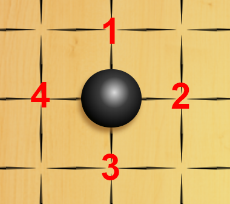

The unoccupied points surrounding a stone or group of stones are known as liberties. A stone is considered alive so long as it has at least one remaining liberty.

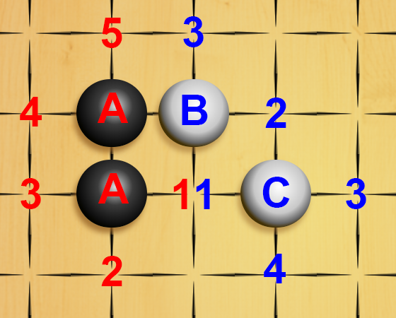

Stones that can be connected along a grid line are considered members of the same group and share liberties. Any stone that occupies one of these liberties affects the liberty count of the entire group.
In the image above the two black stones marked A form one group with 5 liberties. The point marked 1 in two colors is a shared liberty among the black group and the two white groups marked B and C. B and C are not counted as one group, because their relationship is not orthogonal.

### Capturing
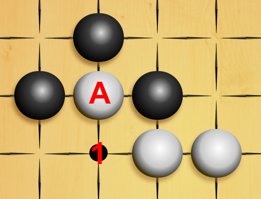

A stone or group of stones with only one remaining liberty is said to be in atari. A play by the opposing player at this point captures those stones and removes them from the board. In territory scoring, such as that assumed by Browser Go, the capturing player retains these stones to add to their score at the end of the game. The points revealed by this capture become liberties for any adjascent stones, and either player can play at these points in the future so long as doing so would not remove their last liberty.

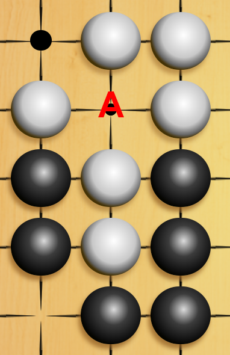

When considering the legality of a given move, the player making the move counts their liberties **after** counting their opponents liberties. Therefore, in the image above the move at A is legal for black. First she counts the liberties of the two stone white group, determines that a move at A would capture, then she counts the liberties of her own group. After the capture this group would have one liberty.

### Ko
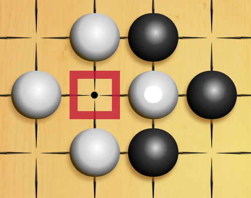

A situation may arise as a consequence of these rules that puts the game into an infinite loop. In the image above white has just captured a stone at the square. Black could conceivably play at the square again, taking back the white stone. Since, this scenario would allow the game to continue indefinitely, it is considered illegal to make a move that would result in the board position of a player's previous move. Put another way, after white captures black must make a move elsewhere on the board before being permitted to play at the square point again.

### Game End
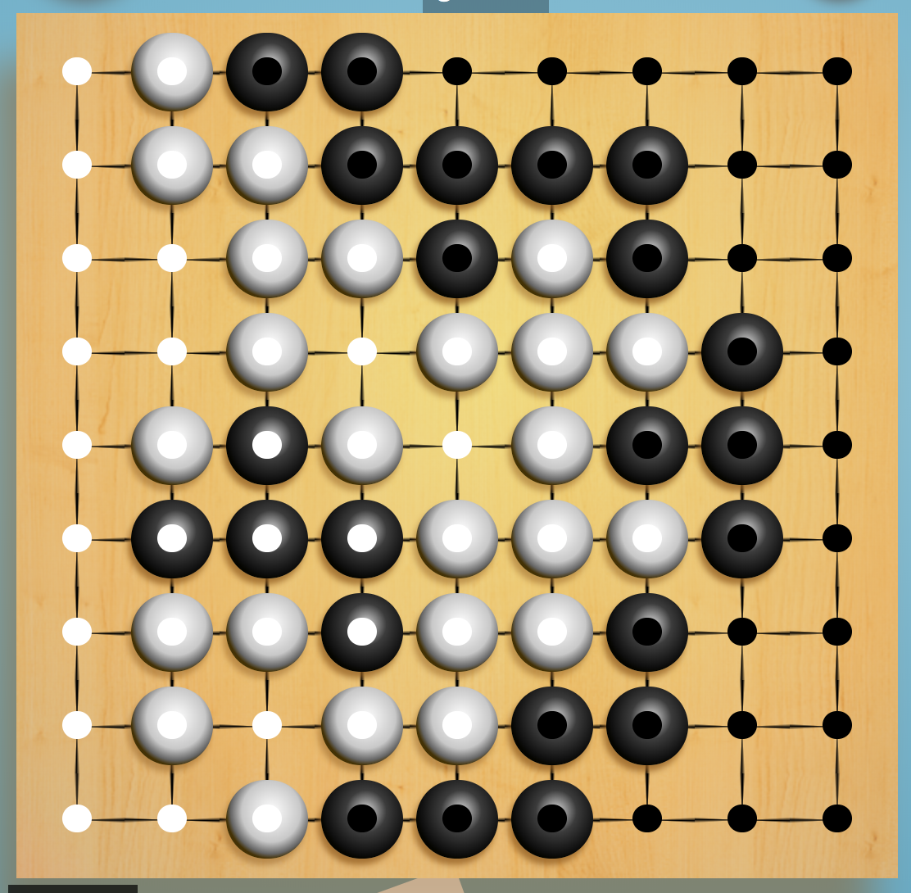

A game of Go may end under one of two conditions. A player may resign at any point, conceding the win to their opponent. Alternatively, the board may reach a position in which neither player can find a profitable move. Players are permitted to pass at any point in the game and if both players pass consecutively, the game is then considered complete.

At this point players may calculate their score. Browser Go uses the Japanese or "territory" counting ruleset, although other means of determining score at game end do exist.

In the image above, both players have chosen to pass. Both players agree that the group of black stones on the left side of the board could not conceivably survive this position, and so that group is considered dead and added to white's captures. In territory counting, each player would then also count the unfilled points that their living stones surround. To either of these counts are added komi, a point advantage granted at the start of the game to one of the players to compensate for the value of the first move or for difference in the players' skill levels.

---
## How Browser Go was Built
---
Browser Go was originally developed for the first project week of a Software Engineering Immersive at General Assembly San Francisco campus in August, 2019.
Technologies used inclue:
* HTML5
* CSS3
* JavaScript (ES2015)

Assets acquired from:
* Google Fonts Library
* subtlepatterns.com
* freesound.org
* the developer's photos of her go equipment

Browser Go was written in Visual Studio Code and originally deployed with GitHub Pages. Wireframing and image editing were accomplished via Adobe Photoshop CC.

---
## Using Browser Go
---
[Play Browser Go Here](https://sorrelbri.github.io/browser-go/) 

### Starting a Game
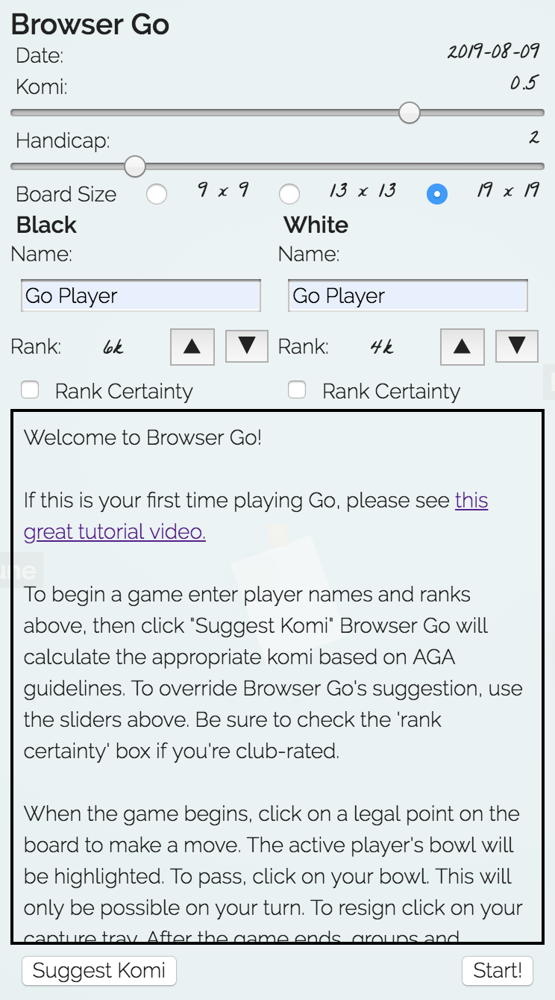

Upon initiation of a new game session, Browser Go will display the new game menu. Here, you will be asked to confirm the size of the board as well as komi and handicap settings. Enter both player's information here. \
Pressing the "Suggest Komi" button will cause Browser Go to calculate your game's komi and handicap stones according to the American Go Association guidelines for your selected board size. If these concepts are unfamiliar, please see [About Go.](#about-go) \
Player name and rank can be changed mid-game, however selections related to the setup of the board cannot.

### Gameplay Elements
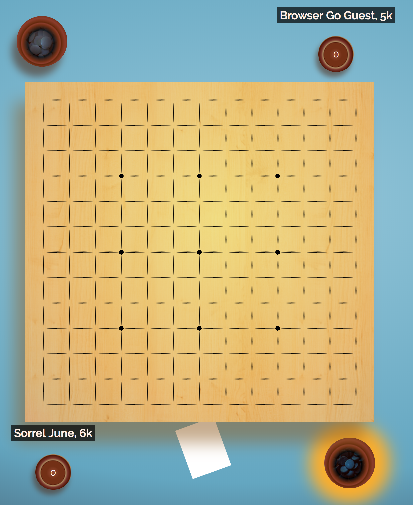

Browser Go's gameplay is oriented from the perspective of the player taking black. Each player's side of the board contains elements that they can interact with. A player's name and rank will be displayed above their capture tray. \
Each player's bowl will alternately glow orange when it is their turn. In addition to marking turn, a player can "cover their bowl" to pass by clicking it. \
Each player also has a capture tray running a total of their captures. On a player's turn they can also choose to "release their prisoners" to resign the game by clicking here. \
Between black's bowl and capture tray is a kifu. By clicking here, either player can view the game setup or review the game's instructions. \
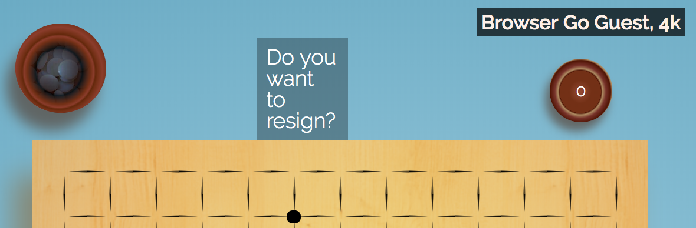

The space on white's side of the board is where gameplay notices are displayed. This is where user's will be asked to confirm their resignation as well as the final board state.

### Gameboard
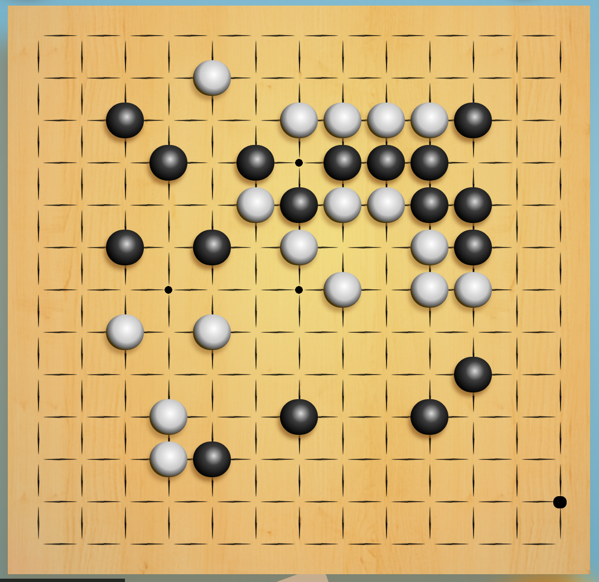

Browser Go will automatically inform players of legal moves. Compare the images below. The first image displays a white dot to the right of black's one space extension, where she hopes to make a peep. This move is legal. \
In the second image, white's cursor is over the point at A, but Browser Go recognizes this as an illegal move and suggests the last legal move that she considered.

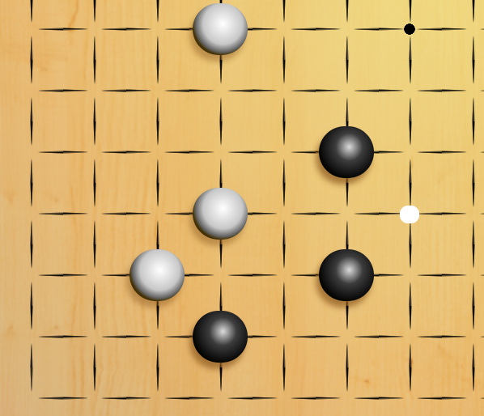 
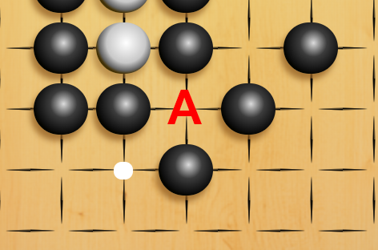

Browser Go informs player's of a ko by displaying a red square around the point of ko. The moving player will not be permitted to play his stone there.

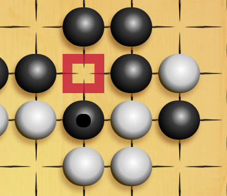

### Ending a Game
A game of Browser Go ends just as any other game of Go ends: upon resignation or a mutual pass.

In the case of mutual pass, Browser Go ends a territory counting state. Seen in the image below. Any group of stones can be toggled between living or dead by clicking on any stone in the group. Any empty area can be toggled between white territory, black territory or dame (neutral points shown as purple) by clicking on any point.

Browser Go will do it's best to count territory accurately according to Japanese territory counting rules, but it is always best to review and submit any changes before finalizing the game.

![image of end game count of 13x13 board, Browser Go Guest has won by a large margin. Browser Go has correctly calculated the status of all groups and has correctly calculated all but 3 points.]

---
## The Future of Browser Go
---
Browser Go's functionality will evolve as it transitions out of it's current client-side architecture.

Additional features in development include:
* game timer
* kifu game record on menu
* support for multiple rulesets
* improve live/dead group recognition and territory count
* smart game format support with
  * read/write ability for .sgf files
  * tsumego (go problems) support
  * support for multiple game lines
* toggleable 'misclick' undo feature
* improved touch screen support
* board animations and expanded sound library
